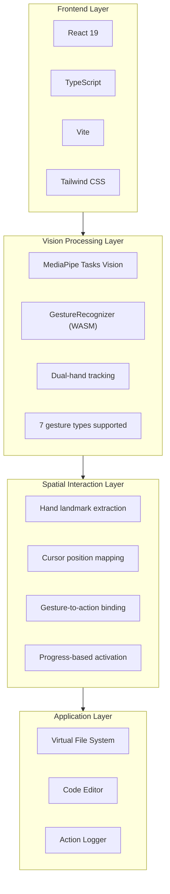
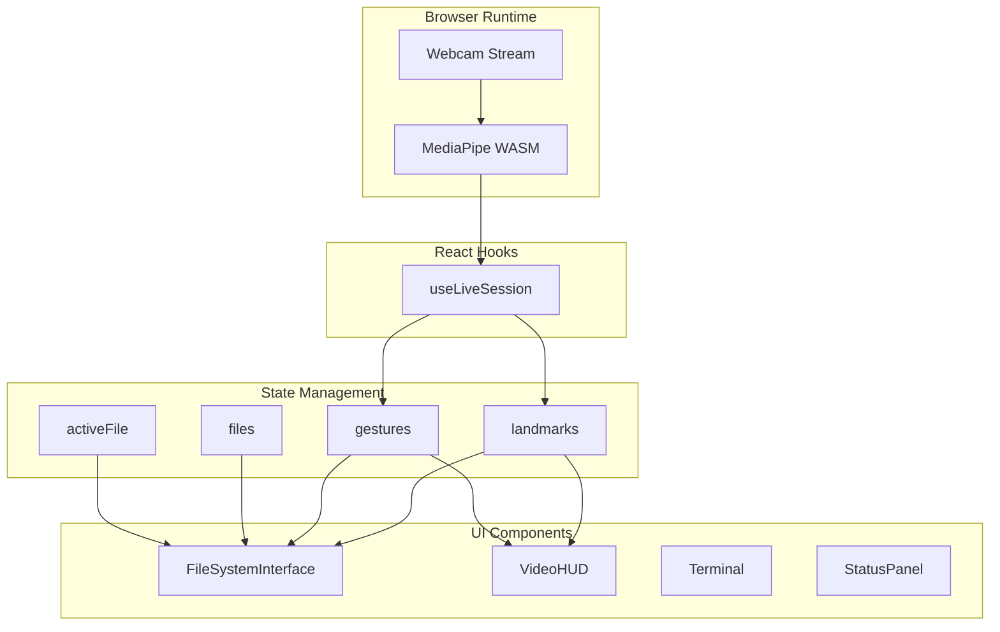

# MotionFlow-Development (v0.0.1)

**Reshaping the Future of Software Development**

A spatial file system interface powered by hand gesture recognition. Navigate, browse, and edit code using natural hand movements.

> Built with AI-assisted development using Claude Code & Google Gemini


## Highlights

- **100% Local** — Runs entirely in your browser, no cloud API required
- **Gesture Conducting** — Orchestrate your workflow with natural hand movements
- **Zero Configuration** — Just `npm install` and start conducting

## Features

- **Spatial Navigation** — Point and pinch to conduct folder traversal
- **Dual-Hand Orchestration** — Coordinate both hands like a conductor: one hand positions, the other signals actions
- **Code Performance** — Open, edit, and save files with gesture commands
- **File Choreography** — Create, rename, and delete files through expressive motions
- **Real-Time Tracking** — MediaPipe captures every nuance of your conducting

## Quick Start

```bash
npm install
npm run dev
```

Open `http://localhost:3000` and allow camera access.

## Gesture Controls

### File Browser Mode

| Gesture | Action | How To |
|---------|--------|--------|
| Drag Folder + Open Palm | Enter folder | Hand 1: Pinch folder and drag out → Hand 2: Show open palm (300ms) |
| Drag File + Open Palm | Open file | Hand 1: Pinch file and drag out → Hand 2: Show open palm (300ms) |
| Pinch Hold on Back | Go back | Pinch on "RETURN" header and hold for 500ms |
| Two Fingers Touch | Create file | Both hands: Touch index fingers together and hold (1s) |
| Drag + Horizontal Point | Rename | Hand 1: Drag item → Hand 2: Point index finger sideways (500ms) |
| Drag + Scissors Cut ✂️ | Delete | Hand 1: Drag item → Hand 2: Victory sign ✌️ then close fingers like scissors |

### File Editor Mode (when file is open)

| Gesture | Action | How To |
|---------|--------|--------|
| Thumb Up 👍 | Save file | Hold thumb up for 1 second |
| Thumb Down 👎 | Revert changes | Hold thumb down for 1 second |
| Closed Fist ✊ | Close file | Hold closed fist for 1 second |
| Horizontal Point | Rename file | Point index finger sideways and hold (800ms) |
| Two-Hand Spread | Zoom text | Use both hands, spread/pinch to adjust font size |

### Number Recognition Mode (0-10)

A special mode for recognizing number gestures using both hands. Count from 0 to 10 by combining numbers from each hand.


| Gesture | Action | How To |
|---------|--------|--------|
| Clap x2 | Toggle number mode | Clap both hands together twice |

**Dual-Hand Counting**: Numbers from both hands are summed together (0-10 range).

**German Style** (thumb extended):
- 1 = Thumb only
- 2 = Thumb + Index
- 3 = Thumb + Index + Middle
- 4 = Thumb + Index + Middle + Ring
- 5 = All fingers

**American Style** (thumb tucked):
- 1 = Index finger only (pointing up)
- 2 = Index + Middle (V sign)
- 3 = Index + Middle + Ring
- 4 = Index + Middle + Ring + Pinky
- 5 = All fingers

**Examples**:
- Left hand: 3 (German) + Right hand: 2 (American) = **5**
- Left hand: 5 + Right hand: 5 = **10**
- No hands detected = **0**

## Tech Stack



## Architecture



## How It Works

### 1. Hand Tracking Pipeline

```
Webcam → MediaPipe WASM → 21 landmarks per hand → Normalized coordinates
```

MediaPipe runs entirely in the browser using WebAssembly. It detects up to 2 hands and outputs 21 landmark points per hand in real-time.

### 2. Gesture Recognition

Gestures used in this application:
- `Pinch & Drag` — Drag files or folders
- `Two Fingers Touch` — Create new file (both index fingers touching)
- `Open_Palm` — Enter folder or open file (with second hand while dragging)
- `Horizontal Point` — Rename file/folder (index finger pointing sideways)
- `Victory + Cut` — Delete file/folder (scissors gesture then close fingers)
- `Closed_Fist` — Close file
- `Thumb_Up` — Save file
- `Thumb_Down` — Revert changes
- `Clap x2` — Toggle number recognition mode (clap hands together twice)
- `Number Gestures (0-10)` — Dual-hand counting, supports German (thumb-first) and American (index-first) styles

### 3. Spatial Mapping

Hand landmarks are mapped to screen coordinates:
```
screenX = (1 - landmark.x) * containerWidth   // Mirrored
screenY = landmark.y * containerHeight
```

### 4. Interaction Model

Actions use a **progress-based activation** system:
- Drag + Palm (300ms) → Enter folder or open file
- Drag + Point (500ms) → Rename
- Drag + Scissors cut → Delete
- Gesture hold (1 second) → Save/Revert/Close

This prevents accidental triggers and provides visual feedback via progress rings.

## Project Structure

```
├── App.tsx                 # Main app, state management
├── constants.ts            # Mock file system data
├── hooks/
│   └── useLiveSession.ts   # MediaPipe integration
└── components/
    ├── FileSystemInterface # Gesture-to-action logic
    ├── VideoHUD            # Camera feed overlay
    ├── Terminal            # Action logger
    └── StatusPanel         # System metrics
```

## Requirements

- Modern browser (Chrome, Edge, Firefox)
- Webcam
- Node.js 18+

## License

MIT

---

*Built with AI-assisted development using [Claude Code](https://claude.ai/code) & [Google Gemini](https://gemini.google.com)*
