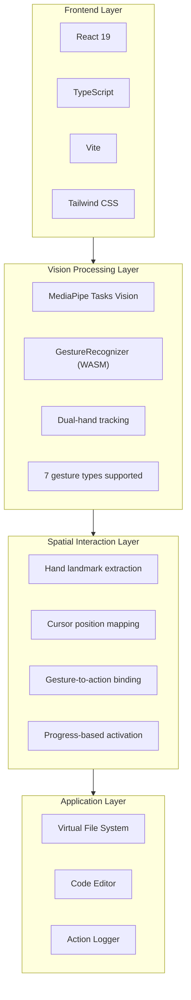
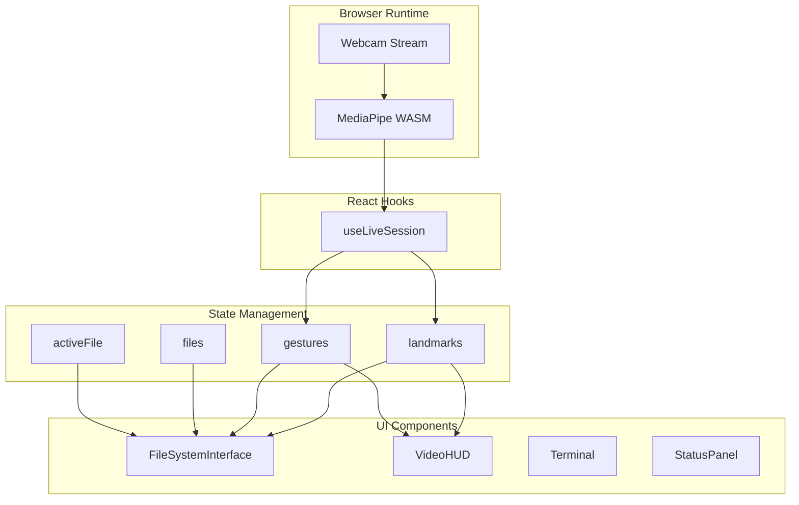

# MotionFlow-Development (v0.0.1)

**Reshaping the Future of Software Development**

A spatial file system interface powered by hand gesture recognition. Navigate, browse, and edit code using natural hand movements — no mouse or keyboard required.

> Built with AI-assisted development using Claude Code & Google Gemini


## Highlights

- **100% Local** — Runs entirely in your browser, no cloud API required
- **Gesture Conducting** — Orchestrate your workflow with natural hand movements
- **Zero Configuration** — Just `npm install` and start conducting

## Features

- **Spatial Navigation** — Point and pinch to conduct folder traversal
- **Dual-Hand Orchestration** — Coordinate both hands like a conductor: one hand positions, the other signals actions
- **Code Performance** — Open, edit, and save files with gesture commands
- **File Choreography** — Create, rename, and delete files through expressive motions
- **Real-Time Tracking** — MediaPipe captures every nuance of your conducting

## Quick Start

```bash
npm install
npm run dev
```

Open `http://localhost:3000` and allow camera access.

## Gesture Controls

| Gesture | Action |
|---------|--------|
| Point + Pinch Hold | Navigate into folder |
| Two Index Fingers Touch | Create new file |
| Drag + Open Palm | Open file viewer |
| Drag + Horizontal Point | Rename file |
| Drag + Scissors Cut | Delete file |
| Thumb Up (hold) | Save file |
| Thumb Down (hold) | Revert changes |
| Closed Fist (hold) | Close file |

## Tech Stack



## Architecture



## How It Works

### 1. Hand Tracking Pipeline

```
Webcam → MediaPipe WASM → 21 landmarks per hand → Normalized coordinates
```

MediaPipe runs entirely in the browser using WebAssembly. It detects up to 2 hands and outputs 21 landmark points per hand in real-time.

### 2. Gesture Recognition

Gestures used in this application:
- `Pinch & Hold` — Drag file
- `Two Fingers Touch` — Create new file (both index fingers touching)
- `Open_Palm` — Open file (with second hand while dragging)
- `Horizontal Point` — Rename file (index finger pointing sideways)
- `Victory + Cut` — Delete file (scissors gesture then close fingers)
- `Closed_Fist` — Close file
- `Thumb_Up` — Save file
- `Thumb_Down` — Revert changes

### 3. Spatial Mapping

Hand landmarks are mapped to screen coordinates:
```
screenX = (1 - landmark.x) * containerWidth   // Mirrored
screenY = landmark.y * containerHeight
```

### 4. Interaction Model

Actions use a **progress-based activation** system:
- Single-hand pinch + hold (1 second) → Navigate
- Dual-hand pinch → Instant click
- Gesture hold (1 second) → File operations

This prevents accidental triggers and provides visual feedback via progress rings.

## Project Structure

```
├── App.tsx                 # Main app, state management
├── constants.ts            # Mock file system data
├── hooks/
│   └── useLiveSession.ts   # MediaPipe integration
└── components/
    ├── FileSystemInterface # Gesture-to-action logic
    ├── VideoHUD            # Camera feed overlay
    ├── Terminal            # Action logger
    └── StatusPanel         # System metrics
```

## Requirements

- Modern browser (Chrome, Edge, Firefox)
- Webcam
- Node.js 18+

## License

MIT

---

*Built with AI-assisted development using [Claude Code](https://claude.ai/code) & [Google Gemini](https://gemini.google.com)*
