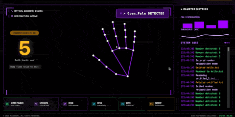
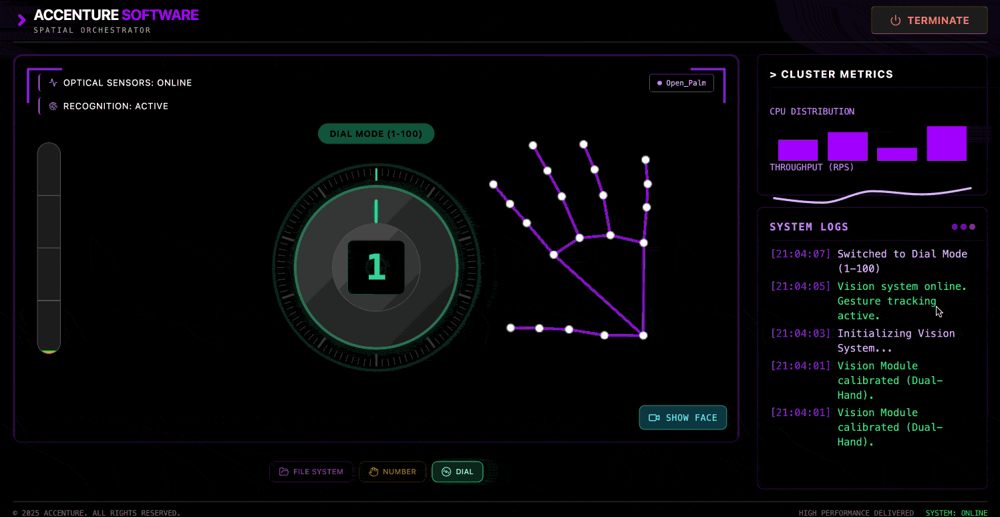
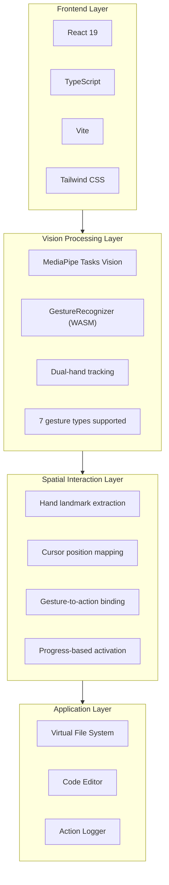
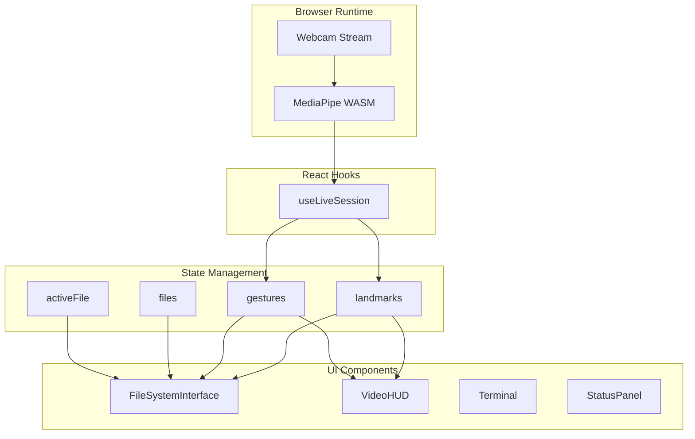

# MotionFlow-Development (v0.0.2)

Exploring the use of hand gesture motion in UI interaction. This project demonstrates three interaction modes powered by hand gesture recognition.

> Built with AI-assisted development using Claude Code & Google Gemini

## Three Modes

### Mode 1: File System Interface
Navigate, browse, and edit code using natural hand movements.


### Mode 2: Number Recognition (0-10)
Count from 0 to 10 using dual-hand gestures.



### Mode 3: Dial Control (1-100)
Rotate your open hand like a radio dial to select values from 1-100. Lock your selection with a second hand.



## Highlights

- **100% Local** — Runs entirely in your browser, no cloud API required
- **Three-Mode Interface** — File system, number recognition, and dial control
- **Zero Configuration** — Just `npm install` and start interacting

## Features

- **Spatial Navigation** — Point and pinch to navigate folders
- **Dual-Hand Orchestration** — Coordinate both hands: one positions, the other signals actions
- **File Operations** — Open, edit, save, create, rename, and delete files with gestures
- **Number Counting** — Recognize 0-10 using German or American finger counting styles
- **Dial Control** — Rotate hand to select 1-100 with lock gesture
- **Real-Time Tracking** — MediaPipe captures hand movements in real-time

## Quick Start

```bash
npm install
npm run dev
```

Open `http://localhost:3000` and allow camera access.

## Gesture Controls

### File Browser Mode

| Gesture | Action | How To |
|---------|--------|--------|
| Drag Folder + Open Palm | Enter folder | Hand 1: Pinch folder and drag out → Hand 2: Show open palm (300ms) |
| Drag File + Open Palm | Open file | Hand 1: Pinch file and drag out → Hand 2: Show open palm (300ms) |
| Pinch Hold on Back | Go back | Pinch on "RETURN" header and hold for 500ms |
| Two Fingers Touch | Create file | Both hands: Touch index fingers together and hold (1s) |
| Drag + Horizontal Point | Rename | Hand 1: Drag item → Hand 2: Point index finger sideways (500ms) |
| Drag + Scissors Cut ✂️ | Delete | Hand 1: Drag item → Hand 2: Victory sign ✌️ then close fingers like scissors |

### File Editor Mode (when file is open)

| Gesture | Action | How To |
|---------|--------|--------|
| Thumb Up 👍 | Save file | Hold thumb up for 1 second |
| Thumb Down 👎 | Revert changes | Hold thumb down for 1 second |
| Closed Fist ✊ | Close file | Hold closed fist for 1 second |
| Horizontal Point | Rename file | Point index finger sideways and hold (800ms) |
| Two-Hand Spread | Zoom text | Use both hands, spread/pinch to adjust font size |

### Number Recognition Mode (0-10)

**Dual-Hand Counting**: Numbers from both hands are summed together (0-10 range).

| Style                   | 1     | 2            | 3       | 4       | 5   |
|-------------------------|-------|--------------|---------|---------|-----|
| German (thumb first)    | Thumb | Thumb+Index  | +Middle | +Ring   | All |
| American (index first)  | Index | Index+Middle | +Ring   | +Pinky  | All |

**Examples**: Left 3 + Right 2 = **5**, Left 5 + Right 5 = **10**, No hands = **0**

### Dial Mode (1-100)

| Gesture               | Action      | How To                                            |
|-----------------------|-------------|---------------------------------------------------|
| Open Hand + Rotate    | Adjust dial | Spread fingers and rotate wrist like turning knob |
| Second Hand Open Palm | Lock value  | Show open palm with other hand to lock for 3s     |

**How it works**: Open your hand with fingers spread, then rotate your wrist clockwise to increase or counter-clockwise to decrease. When you reach your target value, show an open palm with your other hand to lock the selection for 3 seconds.

## Tech Stack



## Architecture



## How It Works

### 1. Hand Tracking Pipeline

```
Webcam → MediaPipe WASM → 21 landmarks per hand → Normalized coordinates
```

MediaPipe runs entirely in the browser using WebAssembly. It detects up to 2 hands and outputs 21 landmark points per hand in real-time.

### 2. Gesture Recognition

Gestures used in this application:
- `Pinch & Drag` — Drag files or folders
- `Two Fingers Touch` — Create new file (both index fingers touching)
- `Open_Palm` — Enter folder or open file (with second hand while dragging)
- `Horizontal Point` — Rename file/folder (index finger pointing sideways)
- `Victory + Cut` — Delete file/folder (scissors gesture then close fingers)
- `Closed_Fist` — Close file
- `Thumb_Up` — Save file
- `Thumb_Down` — Revert changes
- `Number Gestures (0-10)` — Dual-hand counting, supports German (thumb-first) and American (index-first) styles
- `Open Hand Rotate` — Dial mode: rotate wrist to adjust value (1-100)
- `Second Hand Open Palm` — Lock dial value for 3 seconds

### 3. Spatial Mapping

Hand landmarks are mapped to screen coordinates:
```
screenX = (1 - landmark.x) * containerWidth   // Mirrored
screenY = landmark.y * containerHeight
```

### 4. Interaction Model

Actions use a **progress-based activation** system:
- Drag + Palm (300ms) → Enter folder or open file
- Drag + Point (500ms) → Rename
- Drag + Scissors cut → Delete
- Gesture hold (1 second) → Save/Revert/Close
- Hand rotation → Dial value adjustment (continuous)
- Second hand open palm → Lock dial for 3 seconds

This prevents accidental triggers and provides visual feedback via progress rings.

## Project Structure

```
├── frontend/
│   ├── App.tsx                 # Main app, state management
│   ├── constants.ts            # Mock file system data
│   ├── hooks/
│   │   └── useLiveSession.ts   # MediaPipe integration
│   ├── components/
│   │   ├── FileSystemInterface # Gesture-to-action logic
│   │   ├── VideoHUD            # Camera feed overlay
│   │   ├── Terminal            # Action logger
│   │   └── StatusPanel         # System metrics
│   └── dynamicGesture/         # (Optional) dynamic gesture scaffolding
└── ml/                         # Offline training/export only (Python)
```

## Requirements

- Modern browser (Chrome, Edge, Firefox)
- Webcam
- Node.js 18+

## License

MIT

---

*Built with AI-assisted development using [Claude Code](https://claude.ai/code) & [Google Gemini](https://gemini.google.com)*
