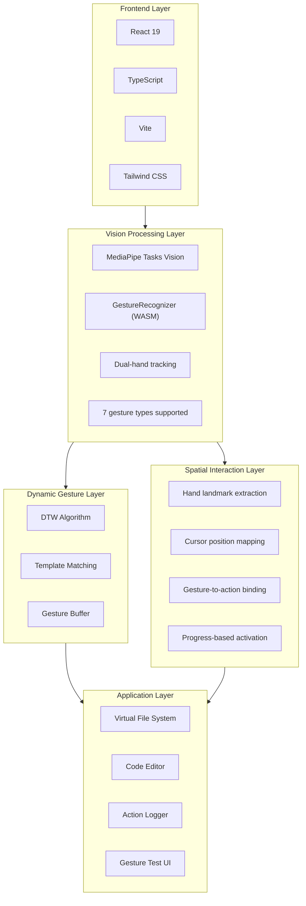
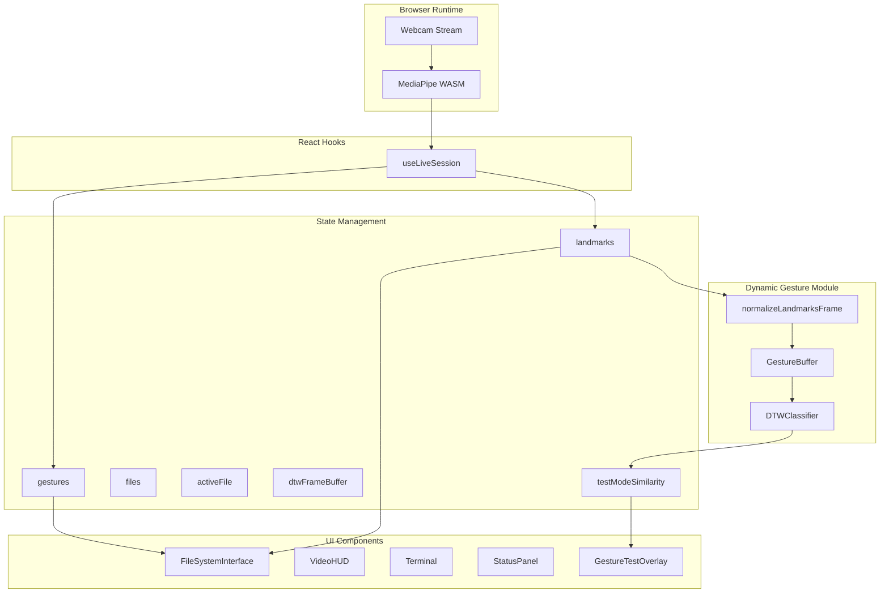

# MotionFlow-Development (v0.0.3)

Exploring the use of hand gesture motion in UI interaction. This project demonstrates four interaction modes powered by hand gesture recognition, including custom dynamic gesture training.

**Train Your Own Gestures**: Record custom dynamic gestures and use them via DTW (Dynamic Time Warping) template matching, or train an LSTM model for multi-class classification. See [Custom Gesture Training](#custom-gesture-training) for details.

> Built with AI-assisted development using Claude Code & Google Gemini

## Four Modes

### Mode 1: File System Interface
Navigate, browse, and edit code using natural hand movements.


### Mode 2: Number Recognition (0-10)
Count from 0 to 10 using dual-hand gestures.


### Mode 3: Dial Control (1-100)
Rotate your open hand like a radio dial to select values from 1-100. Lock your selection with a second hand.


### Mode 4: Gesture Test Mode
Test and debug custom trained dynamic gestures with real-time similarity feedback.

Features:
- Real-time DTW (Dynamic Time Warping) similarity score
- Visual buffer progress indicator
- Threshold-based detection feedback

## Highlights

- **100% Local** — Runs entirely in your browser, no cloud API required
- **Four-Mode Interface** — File system, number recognition, dial control, and gesture testing
- **Custom Gesture Training** — Record and train your own dynamic gestures
- **DTW Recognition** — Dynamic Time Warping for temporal gesture matching
- **Zero Configuration** — Just `npm install` and start interacting

## Features

- **Spatial Navigation** — Point and pinch to navigate folders
- **Dual-Hand Orchestration** — Coordinate both hands: one positions, the other signals actions
- **File Operations** — Open, edit, save, create, rename, and delete files with gestures
- **Number Counting** — Recognize 0-10 using German or American finger counting styles
- **Dial Control** — Rotate hand to select 1-100 with lock gesture
- **Dynamic Gesture Recognition** — Train custom gestures using DTW template matching
- **Real-Time Tracking** — MediaPipe captures hand movements in real-time

## Quick Start

```bash
npm install
npm run dev
```

Open `http://localhost:3000` and allow camera access.

## Gesture Controls

### File Browser Mode

| Gesture | Action | How To |
|---------|--------|--------|
| Drag Folder + Open Palm | Enter folder | Hand 1: Pinch folder and drag out → Hand 2: Show open palm (300ms) |
| Drag File + Open Palm | Open file | Hand 1: Pinch file and drag out → Hand 2: Show open palm (300ms) |
| Pinch Hold on Back | Go back | Pinch on "RETURN" header and hold for 500ms |
| Two Fingers Touch | Create file | Both hands: Touch index fingers together and hold (1s) |
| Drag + Horizontal Point | Rename | Hand 1: Drag item → Hand 2: Point index finger sideways (500ms) |
| Drag + Scissors Cut ✂️ | Delete | Hand 1: Drag item → Hand 2: Victory sign ✌️ then close fingers like scissors |

### File Editor Mode (when file is open)

| Gesture | Action | How To |
|---------|--------|--------|
| Thumb Up 👍 | Save file | Hold thumb up for 1 second |
| Thumb Down 👎 | Revert changes | Hold thumb down for 1 second |
| Closed Fist ✊ | Close file | Hold closed fist for 1 second |
| Horizontal Point | Rename file | Point index finger sideways and hold (800ms) |
| Two-Hand Spread | Zoom text | Use both hands, spread/pinch to adjust font size |

### Number Recognition Mode (0-10)

**Dual-Hand Counting**: Numbers from both hands are summed together (0-10 range).

| Style                   | 1     | 2            | 3       | 4       | 5   |
|-------------------------|-------|--------------|---------|---------|-----|
| German (thumb first)    | Thumb | Thumb+Index  | +Middle | +Ring   | All |
| American (index first)  | Index | Index+Middle | +Ring   | +Pinky  | All |

**Examples**: Left 3 + Right 2 = **5**, Left 5 + Right 5 = **10**, No hands = **0**

### Dial Mode (1-100)

| Gesture               | Action      | How To                                            |
|-----------------------|-------------|---------------------------------------------------|
| Open Hand + Rotate    | Adjust dial | Spread fingers and rotate wrist like turning knob |
| Second Hand Open Palm | Lock value  | Show open palm with other hand to lock for 3s     |

### Gesture Test Mode

| Display | Description |
|---------|-------------|
| BUFFER | Frames collected (0-30) |
| SIMILARITY | Real-time DTW match score (0-100%) |
| THRESHOLD | Minimum similarity to trigger (35%) |

When similarity exceeds threshold, the gesture name is displayed.

## Custom Gesture Training

### 1. Record Training Data

1. Click **NEW MODEL** button in the header
2. Set a label name (e.g., `heart`, `swipe_left`)
3. Set time steps (default: 30 frames)
4. Click **START** and perform the gesture
5. Review and accept/discard the recording
6. Repeat for 20+ samples
7. Click **DOWNLOAD** to save the dataset JSON

### 2. Place Dataset

Copy the downloaded JSON file to:
```
ml/data/raw/
```

### 3. Use in Gesture Test Mode

The app automatically loads templates from `frontend/public/models/gesture_templates.json`.

To update templates:
```bash
cp ml/data/raw/your_dataset.json frontend/public/models/gesture_templates.json
```

### 4. (Optional) Train ML Model

For LSTM-based classification with multiple gesture types:

```bash
cd ml
python3 -m venv venv
source venv/bin/activate
pip install -r requirements.txt

# Train (requires 2+ gesture types)
python -m train.train --data "data/raw/*.json" --epochs 50

# Export to TensorFlow.js
python -m export.export_tfjs --input models/saved_model --output ../frontend/public/models/dynamic_gesture
```

## Tech Stack



## Architecture



## How It Works

### 1. Hand Tracking Pipeline

```
Webcam → MediaPipe WASM → 21 landmarks per hand → Normalized coordinates
```

MediaPipe runs entirely in the browser using WebAssembly. It detects up to 2 hands and outputs 21 landmark points per hand in real-time.

### 2. Static Gesture Recognition

Built-in MediaPipe gestures:
- `Open_Palm` — Enter folder or open file
- `Closed_Fist` — Close file
- `Thumb_Up` — Save file
- `Thumb_Down` — Revert changes
- `Victory` — Scissors gesture for delete
- `Pointing_Up` — Rename

### 3. Dynamic Gesture Recognition (DTW)

For temporal/motion-based gestures:

```
30 frames → Normalize (wrist-relative + scale) → DTW compare → Similarity score
```

**DTW (Dynamic Time Warping)** compares input sequences against recorded templates, handling speed variations in gesture performance.

### 4. Spatial Mapping

Hand landmarks are mapped to screen coordinates:
```
screenX = (1 - landmark.x) * containerWidth   // Mirrored
screenY = landmark.y * containerHeight
```

### 5. Interaction Model

Actions use a **progress-based activation** system:
- Drag + Palm (300ms) → Enter folder or open file
- Drag + Point (500ms) → Rename
- Drag + Scissors cut → Delete
- Gesture hold (1 second) → Save/Revert/Close
- Hand rotation → Dial value adjustment (continuous)
- DTW similarity > 35% → Dynamic gesture triggered

## Project Structure

```
├── frontend/
│   ├── App.tsx                 # Main app, state management, mode switching
│   ├── constants.ts            # Mock file system data
│   ├── hooks/
│   │   └── useLiveSession.ts   # MediaPipe integration
│   ├── components/
│   │   ├── FileSystemInterface # Gesture-to-action logic
│   │   ├── VideoHUD            # Camera feed overlay
│   │   ├── Terminal            # Action logger
│   │   └── StatusPanel         # System metrics
│   ├── dynamicGesture/         # Dynamic gesture recognition module
│   │   ├── dtw.ts              # DTW algorithm implementation
│   │   ├── DTWClassifier.ts    # Template-based classifier
│   │   ├── GestureBuffer.ts    # Frame buffer for sequences
│   │   ├── normalize.ts        # Landmark normalization
│   │   └── types.ts            # Type definitions
│   └── public/
│       └── models/
│           └── gesture_templates.json  # Recorded gesture templates
└── ml/                         # Offline training/export (Python)
    ├── train/
    │   └── train.py            # LSTM training script
    ├── export/
    │   └── export_tfjs.py      # TensorFlow.js export
    ├── data/
    │   ├── raw/                # Raw JSON datasets
    │   └── processed/          # Preprocessed data
    └── requirements.txt
```

## Requirements

- Modern browser (Chrome, Edge, Firefox)
- Webcam
- Node.js 18+

## License

MIT

---

*Built with AI-assisted development using [Claude Code](https://claude.ai/code) & [Google Gemini](https://gemini.google.com)*
