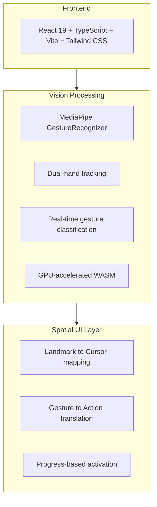
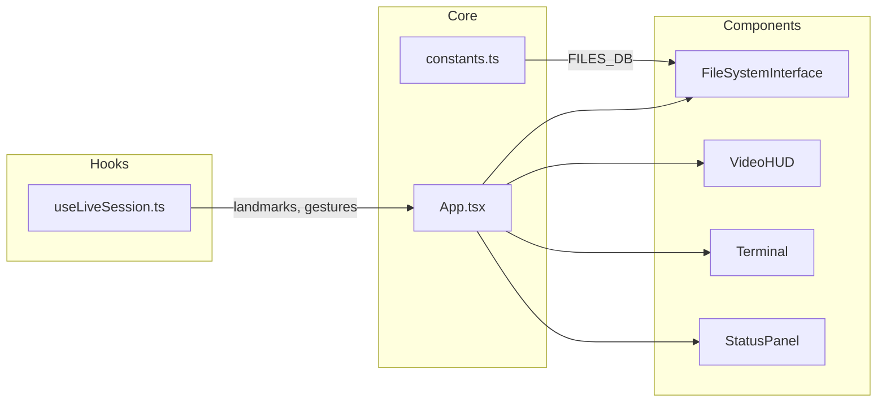

# MotionFlow-Development  ( v0.0.1)

**Reshaping the Future of Software Development**

A spatial file system interface powered by hand gesture recognition. Navigate, browse, and edit code using natural hand movements — no mouse or keyboard required.

<video src="docs/images/demo.mp4" controls autoplay loop muted width="100%"></video>

## Features

- **Gesture-Based Navigation** — Point and pinch to browse folders
- **Dual-Hand Interaction** — Drag files with one hand, trigger actions with the other
- **Code Viewer** — Open, edit, and save files using intuitive gestures
- **Real-Time Hand Tracking** — Powered by MediaPipe with dual-hand support

## Quick Start

```bash
npm install
npm run dev
```

Open `http://localhost:3000` and allow camera access.

## Gesture Controls

| Gesture | Action |
|---------|--------|
| Point + Pinch Hold | Navigate into folder |
| Drag + Open Palm | Open file viewer |
| Thumb Up (hold) | Save file |
| Thumb Down (hold) | Revert changes |
| Closed Fist (hold) | Close file |

## Tech Stack



## Architecture



## License

MIT
